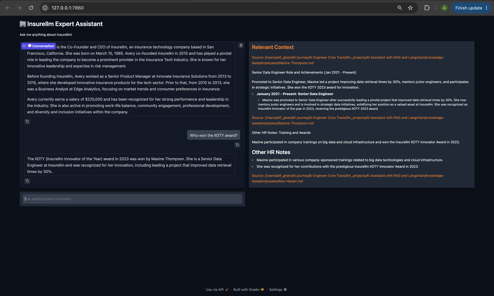
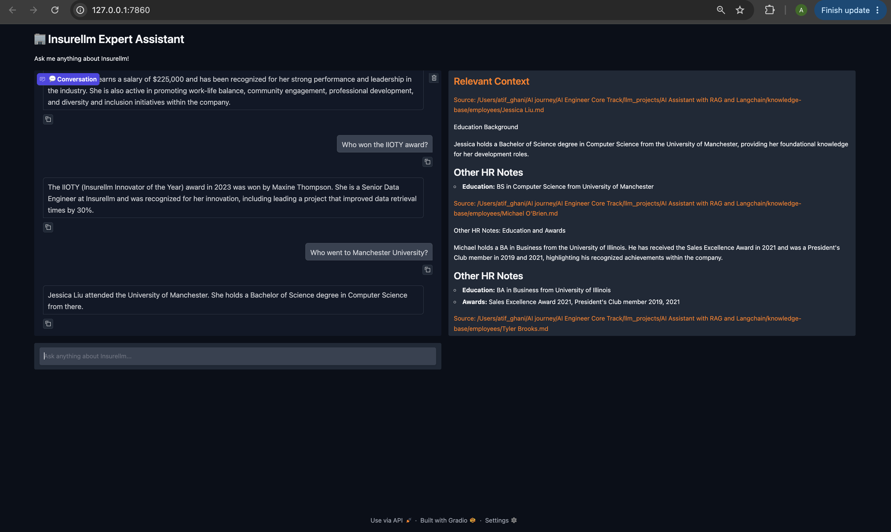
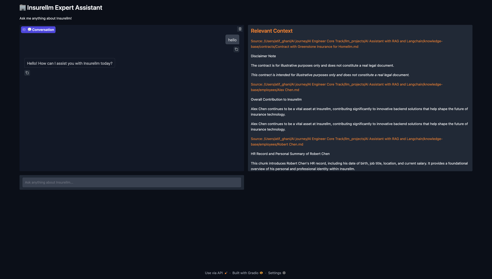
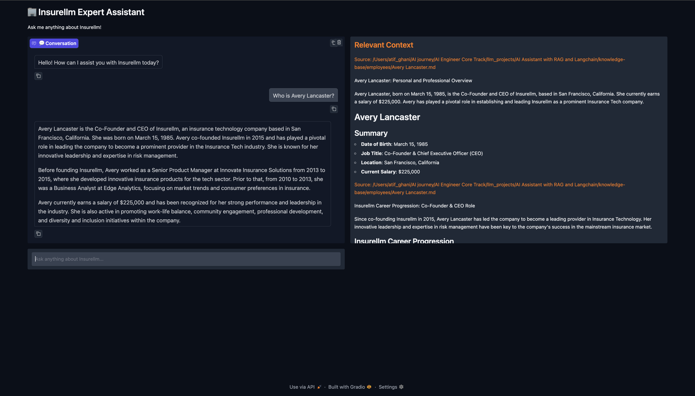
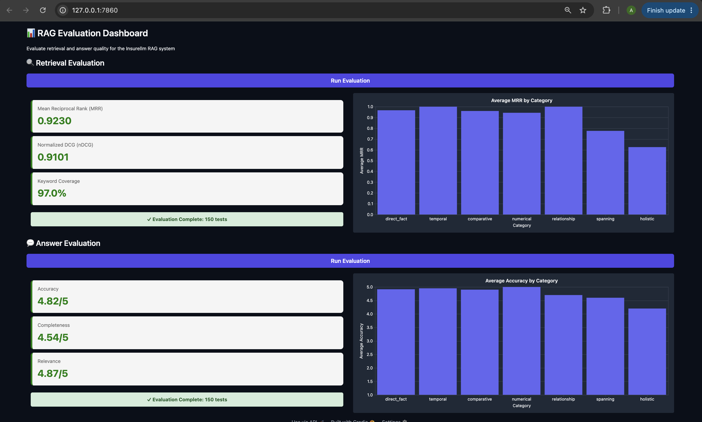

# Insurellm Expert Assistant — RAG with LangChain

An AI assistant that answers questions about a fictional insurance-tech company, **Insurellm**, by retrieving relevant context from a knowledge base and generating grounded answers with an LLM. Built with **LangChain**, **Chroma**, and **OpenAI**, with a **Gradio** chat UI and a dedicated **evaluation dashboard** for measuring retrieval and answer quality.

## Features

- **RAG pipeline** over a company knowledge base (products, contracts, employees, company info)
- **Query rewriting** — condenses conversational history into a single, retrieval-friendly query
- **Dual-query retrieval** — searches with both the original and rewritten question, then merges results
- **LLM re-ranking** — a structured-output call re-orders retrieved chunks by relevance before the final top-k is selected
- **LLM-based chunking at ingestion time** — each document is split into overlapping chunks with a generated headline, summary, and original text, rather than naive fixed-size splitting
- **Gradio chat UI** showing the assistant's answer side-by-side with the exact source chunks used
- **Evaluation dashboard** with retrieval metrics (MRR, nDCG, keyword coverage) and answer-quality metrics (accuracy, completeness, relevance) scored by an LLM judge, broken down by question category

## Architecture

```
Ingestion:  knowledge-base/*.md → LLM chunker → OpenAI embeddings → Chroma vector store

Query time: question + history
              → rewrite_query()          (LLM condenses to a standalone query)
              → similarity_search() x2   (original question + rewritten query)
              → merge_chunks()           (dedupe)
              → rerank()                 (LLM re-orders by relevance)
              → top-k chunks → answer_question() → final response
```

## Project Structure

```
.
├── app.py                     # Gradio chat UI
├── evaluator.py                # Gradio evaluation dashboard
├── implementation/
│   ├── ingest.py               # Loads knowledge base, chunks it via LLM, builds the Chroma vector store
│   └── answer.py                # Query rewriting, retrieval, re-ranking, and answer generation
├── evaluation/
│   ├── eval.py                  # Retrieval + answer evaluation logic (MRR, nDCG, LLM-as-judge)
│   ├── test.py                  # Loads test questions from tests.jsonl
│   └── tests.jsonl              # 150 test questions across 7 categories
├── knowledge-base/
│   ├── company/                 # About, careers, culture, overview
│   ├── contracts/                # Client contracts per product
│   ├── employees/                 # Employee profiles
│   └── products/                   # Product documentation (Carllm, Homellm, Rellm, etc.)
└── vector_db/                    # Persisted Chroma collection
```

## Tech Stack

| Component | Choice |
|---|---|
| Orchestration | LangChain |
| LLM | OpenAI `gpt-4.1-mini` (answers, chunking, rewriting, re-ranking), `gpt-4.1-nano` (evaluation judge) |
| Embeddings | OpenAI `text-embedding-3-large` |
| Vector store | Chroma (local, persisted to disk) |
| UI | Gradio |
| Structured output | Pydantic models + `with_structured_output` |
| Retry handling | Tenacity (exponential backoff) |

## Getting Started

This project uses [`uv`](https://docs.astral.sh/uv/) for dependency management.

### 1. Install dependencies

```bash
uv sync
```

This creates a virtual environment and installs everything listed in `pyproject.toml` / `uv.lock`.

### 2. Set up environment variables

Create a `.env` file in the project root:

```
OPENAI_API_KEY=your-openai-api-key
```

### 3. Build the vector store

```bash
uv run implementation/ingest.py
```

This loads every markdown file in `knowledge-base/`, splits each into overlapping, LLM-generated chunks, embeds them, and persists the result to `vector_db/`.

### Launch the chat assistant

```bash
uv run app.py
```

Opens a Gradio chat UI at `http://127.0.0.1:7860` where you can ask questions about Insurellm and see the retrieved source context alongside each answer.

### 5. Run the evaluation dashboard

```bash
uv run evaluator.py
```

Runs the 150-question test set through the retrieval and answer pipelines and reports aggregate metrics, broken down by category.

## Screenshots

### Chat Assistant

Ask a question and get an answer grounded in the knowledge base, with the exact source chunks shown alongside it.



Follow-up questions use conversation history to rewrite the query before retrieval:



Every answer is paired with its retrieved context and source file path:



Detailed answers pull from multiple source documents:



### Evaluation Dashboard

Retrieval quality (MRR, nDCG, keyword coverage) and answer quality (accuracy, completeness, relevance), broken down by question category, across the full 150-question test set:



## Evaluation Methodology

The test set (`evaluation/tests.jsonl`) contains 150 questions spanning 7 categories: `direct_fact`, `temporal`, `comparative`, `numerical`, `relationship`, `spanning` (requires combining facts from multiple documents), and `holistic` (requires aggregating across many documents).

- **Retrieval metrics** — for each question's expected keywords, Mean Reciprocal Rank and normalized Discounted Cumulative Gain are computed against the ranked retrieved chunks, along with overall keyword coverage.
- **Answer metrics** — an LLM judge compares the generated answer to a reference answer and scores accuracy, completeness, and relevance on a 1–5 scale.

## License

This is a personal/learning project. The knowledge base content (Insurellm, its products, employees, and contracts) is entirely fictional and for demonstration purposes only.