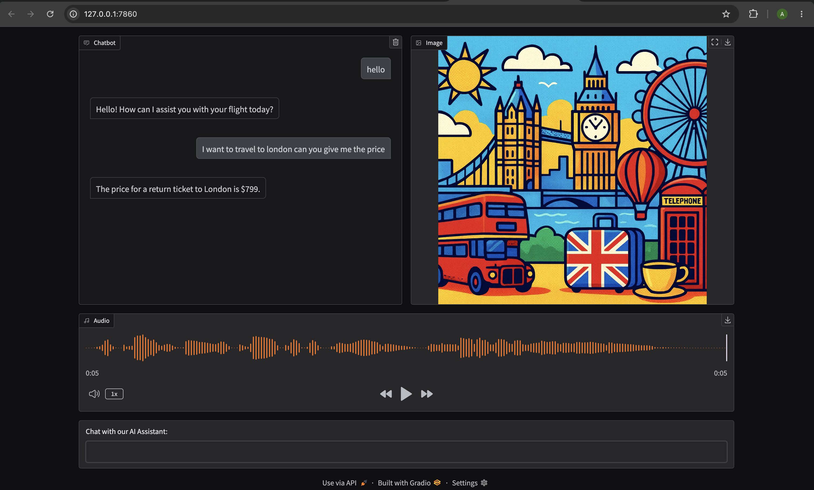

# AI Flight Assistant

A multimodal AI customer service assistant for a fictional airline, **FlightAI**, built with the OpenAI API and Gradio.

The assistant can:

- Chat with customers and answer questions about flights
- Call a **tool/function** to look up real ticket prices from a local SQLite database
- **Speak** its replies out loud using OpenAI's text-to-speech model
- **Generate an image** of the destination city using OpenAI's image generation model

---

## Screenshot



---

## How it works

1. The user sends a message through the Gradio chat UI.
2. The message is sent to the OpenAI Chat Completions API along with a `tools` definition for `get_ticket_price`.
3. If the model decides it needs live pricing data, it returns a **tool call** instead of a direct answer.
4. The app looks up the requested city's price in a local SQLite database (`prices.db`) and sends the result back to the model.
5. The model uses that result to generate a final natural-language reply.
6. The reply is converted to speech (`talker`) and, if a city was mentioned, an illustrative image of that city is generated (`artist`).
7. The chat text, audio, and image are all displayed in the Gradio interface.

---


## Tech stack

- **OpenAI API** — `gpt-4.1-mini` for chat + tool calling, `gpt-image-1-mini` for images, `gpt-4o-mini-tts` for speech
- **Gradio (Blocks)** — custom multi-output UI (chat, audio, image)
- **SQLite** — lightweight local database for ticket prices
- **Pillow** — image decoding/handling

---


## Project structure

```
AI Flight Assistant with gradio/
├── AI_Assitant.ipynb   # Main notebook: all logic + Gradio UI
├── README.md
├── screenshot.png
└── prices.db           # SQLite database of ticket prices (auto-created on first run)
```

---


## Setup

1. Install dependencies (via `uv` or `pip`):
  ```bash
   uv add openai gradio python-dotenv pillow
  ```
2. Create a `.env` file in the project root with your OpenAI API key:
  ```
   OPENAI_API_KEY=sk-...
  ```
3. Run all cells in `AI_Assitant.ipynb` from top to bottom.
4. The Gradio app will launch in your browser.

---


## Example usage

> **You:** How much is a ticket to Paris?
> **FlightAI:** A return ticket to Paris is $899.
> *(spoken aloud, with a generated pop-art image of Paris shown alongside)*

---


## Notes / possible improvements

- Tool dispatch is currently a simple `if` check for `get_ticket_price`; this could be refactored into a generic `{name: function}` lookup dictionary to scale to more tools without editing the handler each time.
- Currently only the first city mentioned in a multi-tool-call turn gets an illustrative image generated.
- Ticket prices are seeded once from a hardcoded dictionary; in a production system these would come from a live pricing API.

