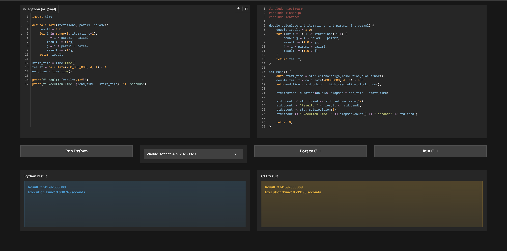
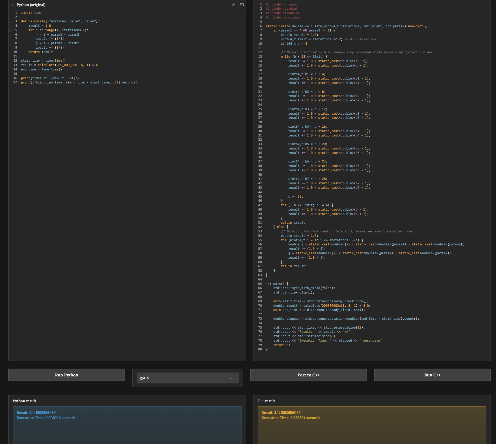

# AI-Powered Code Optimizer
 
A Gradio app that ports Python code to optimized C++ using an LLM (GPT-5 or Claude Sonnet), then compiles and runs both versions so you can compare performance side by side.
 
## Overview
 
This project takes a piece of Python code, sends it to a large language model, and asks it to rewrite it as fast, optimized C++. The generated C++ is compiled and executed locally, so you can directly compare runtime performance between the interpreted Python and the compiled C++.
 
The default example calculates an approximation of **pi** using a tight, iteration-heavy loop — a great stress test since Python is dramatically slower than compiled C++ at this kind of numerical work.
 
## How It Works
 
1. **Write or paste Python code** into the left-hand code editor.
2. Click **Run Python** to execute it directly in the browser and see the output.
3. **Choose a model** from the dropdown — `gpt-5` or `claude-sonnet-4-5-20250929`.
4. Click **Port to C++**. The Python code, your system info, and the exact compiler command are sent to the model, which returns optimized C++ with no extra explanation.
5. The generated code appears in the right-hand editor and is saved to `main.cpp`.
6. Click **Run C++** to compile and execute the generated code.
7. Compare the **Python result** and **C++ result** side by side, including execution time.
## Compiler Setup
 
```python
compile_command = ["clang++", "-std=c++20", "-O3", "-DNDEBUG", "-flto=thin", "main.cpp", "-o", "main"]
run_command = ["./main"]
```
 
This uses `clang++` with the **C++20** standard, full optimization (`-O3`), assertions disabled (`-DNDEBUG`), and thin link-time optimization for extra speed.
 
On macOS, `clang++` ships with the Xcode Command Line Tools. Check availability with:
 
```bash
clang++ --version
```
 
If it's missing, install it with:
 
```bash
xcode-select --install
```
 
## Project Structure
 
| File | Description |
|---|---|
| `app.ipynb` | The Jupyter notebook with the Gradio app and all supporting code |
| `system_info.py` | Gathers local machine info (OS, CPU, memory) to include in prompts |
| `styles.py` | Custom CSS for the Gradio interface |
| `main.cpp` | Most recently generated C++ source file |
| `main` | Most recently compiled C++ binary |
 
## Environment Variables
 
Create a `.env` file in the project root with:
 
```
OPENAI_API_KEY=your_openai_key
ANTHROPIC_API_KEY=your_anthropic_key
```
 
- **OPENAI_API_KEY** — required for the `gpt-5` model
- **ANTHROPIC_API_KEY** — optional, only needed for `claude-sonnet-4-5-20250929`
The Anthropic model is accessed through its OpenAI-compatible endpoint at `https://api.anthropic.com/v1/`, so the same client code works for both providers.
 
## Example Results
 
Both runs port the same pi calculation. The Python version takes roughly **9.8 seconds**, while the compiled C++ version finishes in a fraction of a second.
 
### Claude Sonnet 4.5
 
A direct, faithful translation of the Python loop into C++ — completes in about **0.22 seconds**.
 

 
### GPT-5
 
A more aggressive translation that manually unrolls the loop for extra speed, producing an identical result in about **0.23 seconds**.
 

 
## Running the Project
 
1. Install dependencies from `pyproject.toml`:
```bash
   uv sync
```
2. Create a `.env` file with your API keys (see above).
3. Open `app.ipynb` in Jupyter and run all cells.
4. The Gradio interface will open automatically in your browser.
## Notes
 
- `compile_and_run` uses `subprocess.run(check=True)`, so compiler errors are captured and shown in the C++ result box instead of crashing the notebook.
- Because the model receives your exact compile command and system info in the prompt, the generated C++ is tailored to your machine rather than being a generic translation.
 
