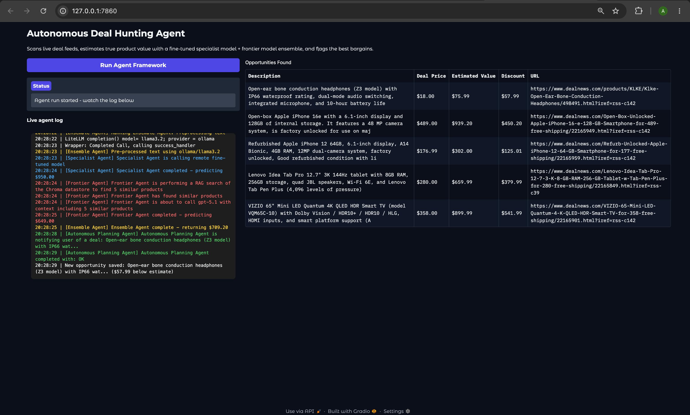

# Multi Agent Price Estimator
 
An autonomous multi-agent system that scans live deal feeds, estimates the true
value of each product using a fine tuned specialist model combined with a
retrieval augmented frontier model, and surfaces the best bargains through a
Gradio interface.
 
The project is built around a tool-calling planning agent (GPT-5.1) that
orchestrates a scanning agent, a two-model pricing ensemble, and a
notification step, with the results persisted and displayed in a live web UI.
 
 
## Demo
 

 
A completed run: the scanner found candidate deals, the ensemble priced each
one, and the planning agent flagged the bone conduction headphones as the
best bargain ($18.00 against an estimated value of $75.99).
 
 
## Contents
 
- [Demo](#demo)
- [Architecture](#architecture)
- [Project structure](#project-structure)
- [How a run works](#how-a-run-works)
- [Prerequisites](#prerequisites)
- [Installation](#installation)
- [Environment variables](#environment-variables)
- [One-time setup](#one-time-setup)
- [Running the application](#running-the-application)
- [Troubleshooting](#troubleshooting)
- [Acknowledgments](#acknowledgments)
- [License](#license)
## Architecture
 
```
                        ┌─────────────────────────────┐
                        │  Autonomous Planning Agent  │
                        │  (GPT-5.1, tool calling)    │
                        └───────────────┬─────────────┘
                                        │ tools
            ┌───────────────────────────┼───────────────────────────┐
            │                           │                           │
            ▼                           ▼                           ▼
    ┌──────────────-─┐          ┌────────────────┐          ┌────────────────────-┐
    │ Scanner Agent  │          │ Ensemble Agent │          │ notify_user_of_deal │
    │ (gpt-5-mini)   │          │                │          │ (records best deal) │
    └───────┬────────┘          └───────┬───────-┘          └─────────────────────┘
            │                           │
            ▼                           ├────────────────────┐
    DealNews RSS feeds                  ▼                    ▼
    (Electronics, Computers,   ┌────────────────-┐    ┌───────────────────-─┐
     Smart Home)               │ Preprocessor    │    │ Specialist Agent    │
                               │ (Ollama/LiteLLM)│    │ (Modal, fine-tuned  │
                               └-───────┬───────-┘    │  Llama-3.2-3B)      │
                                        │             └──────────┬──────────┘
                                        ▼                        │
                                ┌────────────────-┐              │
                                │ Frontier Agent  │              │
                                │ (GPT-5.1 + RAG  │              │
                                │  via Chroma)    │              │
                                └────────┬────────┘              │
                                         │                       │
                                         └──────────┬────────────┘
                                                    ▼
                                    combined = 0.8 * frontier + 0.2 * specialist
```
 
Each deal's estimated value is a weighted blend of two independent price
estimators: a fine-tuned open-weights model running on Modal (the
"specialist"), and a frontier LLM given retrieval-augmented context from a
vector store of comparable products (the "frontier" estimate). The planning
agent decides, at runtime, which single deal represents the best bargain and
records it.
 
 
## Project structure
 
```
.
├── assets
│   └── app_screenshot.jpg          Screenshot used in this README
├── agents
│   ├── agent.py                    Base class: colored console logging
│   ├── autonomous_planning_agent.py Tool-calling orchestrator (GPT-5.1)
│   ├── deals.py                    Pydantic models + DealNews RSS scraping
│   ├── ensemble_agent.py           Combines specialist + frontier estimates
│   ├── frontier_agent.py           RAG price estimate via GPT-5.1 + Chroma
│   ├── items.py                    Item model used to build the vector store
│   ├── preprocessor.py             Rewrites raw descriptions via Ollama/LiteLLM
│   ├── scanner_agent.py            Selects the 5 best-described deals (gpt-5-mini)
│   └── specialist_agent.py         Calls the fine-tuned model on Modal
├── app.py                          Gradio web interface
├── prepare_vectorstore.py          Builds the Chroma vector store (run once)
├── modal
│   └── pricer_service.py           Modal deployment of the fine-tuned pricer
├── notebooks
│   ├── prepare_prompts.ipynb       Builds the fine-tuning dataset
│   └── finetune_specialist.ipynb   Fine-tunes and uploads the specialist model
├── products_vectorstore/           Generated: Chroma persistent store (gitignored)
├── memory.json                     Generated: persisted opportunities (gitignored)
├── pyproject.toml
├── README.md
```
 
 
## How a run works
 
1. **Scan.** 
  `ScannerAgent` pulls the latest entries from three DealNews RSS
   feeds (Electronics, Computers, Smart Home), scrapes each linked page for a
   fuller description, and asks `gpt-5-mini` to select the 5 deals with the
   clearest description and price.
2. **Estimate.** 
   For each candidate deal, `EnsembleAgent`:
   - rewrites the description into a compact, consistent format via
     `Preprocessor` (a local Ollama model by default, through LiteLLM),
   - gets a price estimate from `SpecialistAgent`, a LoRA-fine-tuned
     Llama-3.2-3B model served remotely on Modal,
   - gets a second price estimate from `FrontierAgent`, which retrieves the
     5 most similar products from a Chroma vector store and asks `gpt-5.1`
     to estimate a price given that context,
   - combines both estimates as `0.8 * frontier + 0.2 * specialist`.
3. **Decide and notify.** 
   `AutonomousPlanningAgent` runs this whole flow as a
   sequence of tool calls, compares each deal's offered price against its
   estimated value, and calls `notify_user_of_deal` exactly once, for the
   single deal with the largest gap between price and estimated value.
4. **Persist and display.** 
   `app.py` records the resulting opportunity to
   `memory.json` (so future scans skip deals already seen) and displays it,
   along with all prior opportunities, in a table. Agent activity is logged
   live in the interface.
## Prerequisites
 
- Python 3.11 or later
- An OpenAI API key
- A Hugging Face account and access token (`HF_TOKEN`)
- A Modal account, with the CLI authenticated (`modal setup`)
- Ollama installed and running locally, with a model pulled (default:
  `llama3.2`), **or** a different preprocessing model configured (see
  [Environment variables](#environment-variables))
- A Google Colab account with GPU access, only if you intend to re-run
  `finetune_specialist.ipynb` yourself
- A Weights & Biases account, only if you want training metrics logged
  during fine-tuning (optional; controlled by `LOG_TO_WANDB` in the notebook)
## Installation
 
This project uses [uv](https://docs.astral.sh/uv/) for dependency management.
 
```bash
git clone https://github.com/<your-username>/multi-agent-price-estimator.git
cd multi-agent-price-estimator
 
uv sync
```
 
`uv sync` creates a `.venv` and installs everything listed in
`pyproject.toml`. To run any command inside that environment, prefix it with
`uv run` (for example `uv run app.py`), or activate the environment directly:
 
```bash
source .venv/bin/activate      # on Windows: .venv\Scripts\activate
```
 
`torch`, `transformers`, `bitsandbytes`, `accelerate`, and `peft` are **not**
listed as dependencies here — they are installed inside the Modal container
image defined in `modal/pricer_service.py` and only run on Modal's
infrastructure.
 
 
## Environment variables
 
Create a `.env` file in the project root:
 
```
OPENAI_API_KEY=sk-...
HF_TOKEN=hf_...
 
# Optional overrides (defaults shown)
CHROMA_PATH=products_vectorstore
CHROMA_COLLECTION=products
HF_DATASET=ed-donner/items_lite
PRICER_PREPROCESSOR_MODEL=ollama/llama3.2
```
 
| Variable | Required | Purpose |
|---|---|---|
| `OPENAI_API_KEY` | Yes | Used by the scanner, frontier, and planning agents |
| `HF_TOKEN` | Yes, for building the vector store | Hugging Face access for the training dataset and the fine-tuned model |
| `CHROMA_PATH` | No | Path to the persistent Chroma store |
| `CHROMA_COLLECTION` | No | Name of the Chroma collection queried by `FrontierAgent` |
| `HF_DATASET` | No | Dataset used to build the vector store |
| `PRICER_PREPROCESSOR_MODEL` | No | Model used by `Preprocessor`; defaults to a local Ollama model |
 
Modal also needs its own credentials (`modal setup`) and a stored secret
containing your Hugging Face token, since `pricer_service.py` references it
by name:
 
```bash
modal secret create huggingface-secret HF_TOKEN=hf_...
```
 
 
## One-time setup
 
These steps only need to be repeated if you change the underlying dataset or
fine-tuned model.
 
**1. Prepare the training prompts.**
`notebooks/prepare_prompts.ipynb` loads the `ed-donner/items_lite` dataset,
tokenizes each item's summary against the `meta-llama/Llama-3.2-3B`
tokenizer, and plots the resulting token-count distribution to choose a
sensible truncation cutoff (110 tokens by default). It then builds a
prompt/completion pair for every item and pushes the result to your own
Hugging Face dataset repository (for example `<your-username>/items_prompts`).
 
Note: as written, this notebook imports `from pricer.items import Item`. This
repository's equivalent module lives at `agents/items.py`, so update that
import to `from agents.items import Item` (or run the notebook from a
location where `pricer` resolves correctly) before executing it locally.
 
**2. Fine-tune and publish the specialist model.**
`notebooks/finetune_specialist.ipynb` was run on Google Colab, since
fine-tuning requires a GPU. It loads the prompt dataset produced in the
previous step, applies 4-bit QLoRA fine-tuning to `meta-llama/Llama-3.2-3B`
(rank-32 LoRA adapters on the attention projection layers) using TRL's
`SFTTrainer`, optionally logs metrics to Weights & Biases, and pushes the
resulting adapter privately to the Hugging Face Hub as
`<HF_USER>/price-<RUN_NAME>`.
 
Colab notebook: `<ADD_COLAB_LINK_HERE>`
 
After fine-tuning, update `BASE_MODEL`, `HF_USER`, `RUN_NAME`, and `REVISION`
in `modal/pricer_service.py` to match the model you just published.
 
**2. Deploy the pricer service to Modal.**
 
```bash
cd modal
modal deploy pricer_service.py
```
 
Confirm the deployed app name is `pricer-service` — this is the name
`SpecialistAgent` looks up at runtime via `modal.Cls.from_name`.
 
**3. Build the vector store.**
 
Independent of the two steps above — this uses the original
`ed-donner/items_lite` dataset directly, not your fine-tuning dataset.
 
```bash
python prepare_vectorstore.py
```
 
Use `--rebuild` to force a fresh build if the dataset or embeddings change:
 
```bash
python prepare_vectorstore.py --rebuild
```
 
 
## Running the application
 
```bash
python app.py
```
 
This starts a local Gradio server (by default at `http://127.0.0.1:7860`).
Click "Run Agent Framework" to trigger a full scan-estimate-notify cycle.
Agent activity streams into the live log panel, and any newly identified
opportunity is added to the table and saved to `memory.json`.
 
 
## Troubleshooting
 
**The run completes but nothing appears in the table.**
Check the log panel for where the run stopped. Common causes:
- Ollama is not running, or the configured model is not pulled locally
  (`ollama pull llama3.2`), which fails the preprocessing step.
- The Chroma collection referenced by `CHROMA_COLLECTION` does not exist or
  is empty — run `prepare_vectorstore.py` first.
- The Modal app name deployed does not match `pricer-service`, or
  `HF_TOKEN` is missing from the Modal secret used during model loading.
**Startup fails immediately.**
`app.py` logs the specific initialization error (Chroma connection, Modal
lookup, or agent construction) instead of crashing silently — read the first
few log lines for the cause.
 
**The vector store already exists but I changed the dataset.**
Re-run `python prepare_vectorstore.py --rebuild`.
 
**Estimated values look implausibly high or low for a specific item.**
The frontier estimate depends on which 5 items the retrieval step finds as
"similar" — a niche or ambiguous product description can retrieve poor
comparables. Treat the ensemble output as a starting estimate, not a
guaranteed valuation, when reviewing flagged opportunities.
 
 
## Acknowledgments
 
The deal-scanning and RAG-based pricing approach builds on patterns and
sample data (the `ed-donner/items_lite` dataset and DealNews RSS feeds) from
Ed Donner's LLM Engineering course.
 
 
 
