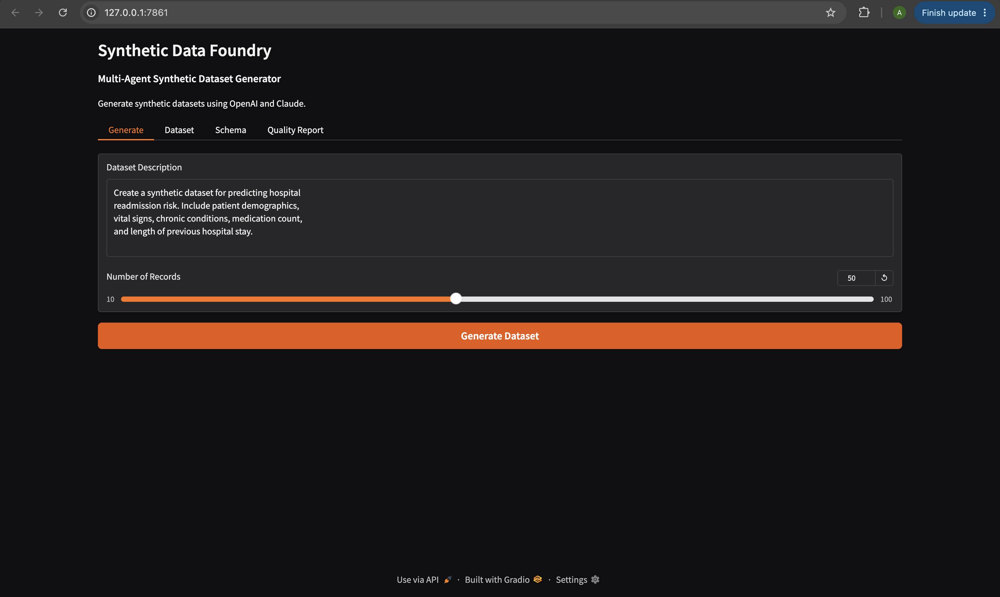
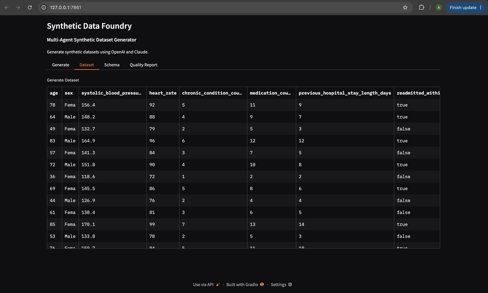
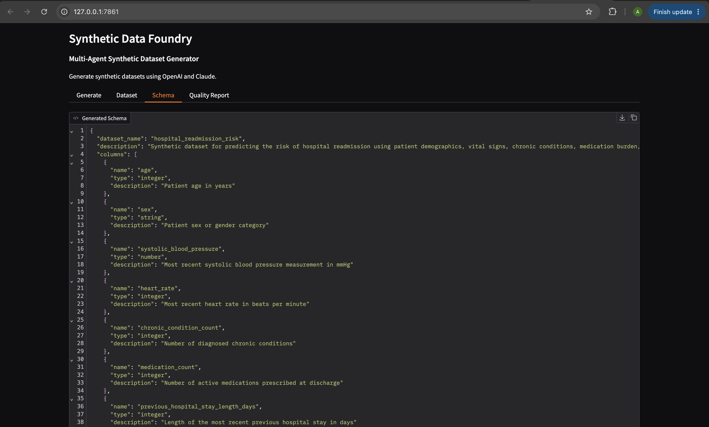
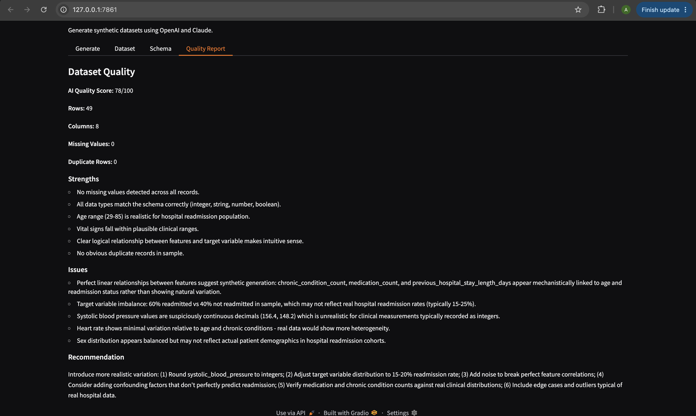

# Synthetic Data Foundry

**Multi-Agent Synthetic Dataset Generator** — powered by OpenAI + Claude, wrapped in a Gradio UI.

Describe any dataset you need in plain English, and Synthetic Data Foundry will design a schema, generate realistic rows using two different LLMs in parallel, validate the result, and produce an AI-written data quality report — all in one click.

---

## Features

- **Natural language → schema**: Describe your dataset and GPT designs a clean, typed schema (5–10 columns, with a target variable when appropriate).
- **Multi-agent generation**: Rows are split between **OpenAI (GPT)** and **Anthropic (Claude)**, so the dataset benefits from two independent generation styles instead of one model's biases/patterns.
- **Automatic validation**: Checks row/column counts, missing values, duplicate rows, and schema conformance.
- **AI-generated quality report**: Claude acts as a data quality critic, scoring the dataset out of 100 and listing strengths, issues, and concrete recommendations.
- **Interactive Gradio UI**: Four tabs — *Generate*, *Dataset*, *Schema*, *Quality Report* — so you can configure, preview, inspect, and export everything without touching code.

## How It Works

```
User description
      │
      ▼
 ┌─────────────┐
 │Schema Agent │  (OpenAI) → designs column names, types, and descriptions
 └─────────────┘
      │
      ▼
 ┌───────────────────────┬───────────────────────┐
 │  OpenAI Generator     │  Claude Generator     │  → each generates half the rows
 └───────────────────────┴───────────────────────┘
      │
      ▼
 ┌─────────────┐
 │  Combiner   │  → merges both outputs into one DataFrame
 └─────────────┘
      │
      ▼
 ┌─────────────┐
 │  Validator  │  → checks types, missing values, duplicates
 └─────────────┘
      │
      ▼
 ┌─────────────┐
 │Critic Agent │  (Claude) → scores quality, flags issues, gives recommendations
 └─────────────┘
      │
      ▼
   Gradio UI
```

### 1. Generate tab — describe your dataset
Add your first screenshot here (dataset description + number of records + "Generate Dataset" button):

```md

```

### 2. Dataset tab — preview generated rows
Add your second screenshot here (the resulting table of synthetic rows):

```md

```

### 3. Schema tab — view the generated JSON schema
Add your third screenshot here (the auto-designed schema in JSON):

```md

```

### 4. Quality Report tab — AI-generated critique
Add your fourth screenshot here (quality score, strengths, issues, recommendations):

```md

```

## 🛠️ Tech Stack

| Component        | Tool/Library                     |
|-------------------|-----------------------------------|
| UI                | [Gradio](https://gradio.app)     |
| LLM Provider 1    | OpenAI (`gpt-5.4-mini`)          |
| LLM Provider 2    | Anthropic Claude (`claude-haiku-4-5`) |
| Data handling     | pandas                           |
| Config            | python-dotenv                    |

## 🚀 Getting Started

### 1. Clone the repo

```bash
git clone https://github.com/<your-username>/synthetic-data-foundry.git
cd synthetic-data-foundry
```

### 2. Install dependencies

```bash
pip install openai anthropic pandas gradio python-dotenv
```

### 3. Set up your API keys

Create a `.env` file in the project root:

```env
OPENAI_API_KEY=sk-...
ANTHROPIC_API_KEY=sk-ant-...
```

> The Anthropic key is used both for generating rows and for the AI quality critic. If you omit it, generation and critique steps that call Claude will fail — OpenAI alone can't be swapped in for those steps without code changes.

### 4. Run the app

```bash
python app.py
```

Then open the local URL shown in your terminal (typically `http://127.0.0.1:7861`).

## 🎯 Usage

1. Go to the **Generate** tab.
2. Describe the dataset you want, e.g.:
   > *"Create a synthetic dataset for predicting hospital readmission risk. Include patient demographics, vital signs, chronic conditions, medication count, and length of previous hospital stay."*
3. Choose the number of records (10–100).
4. Click **Generate Dataset**.
5. Review results in the **Dataset**, **Schema**, and **Quality Report** tabs.

## 📁 Project Structure

```
synthetic-data-foundry/
├── app.py               # Main Gradio app (schema design, generation, validation, critique, UI)
├── .env                 # API keys (not committed — add to .gitignore)
├── screenshots/          # UI screenshots used in this README
└── README.md
```

## ⚠️ Known Limitations

The built-in AI quality critic currently flags a few recurring issues worth being aware of:

- Numeric fields (e.g. chronic condition count, medication count, previous stay length) can end up too tightly/linearly correlated with age or the target variable rather than showing natural variation.
- Target variable class balance isn't guaranteed to match real-world base rates unless explicitly prompted for.
- Some continuous fields may generate unrealistic decimal precision for values normally recorded as integers (e.g. blood pressure).

**Planned improvements:**
- [ ] Add explicit prompting for realistic noise/variation in numeric fields.
- [ ] Let users specify target class balance.
- [ ] Add column-level type/precision hints (e.g. force integers where appropriate).
- [ ] Add a CSV/JSON export button in the UI.

## 📄 License

Add your preferred license here (e.g. MIT).

## 🙌 Acknowledgements

Built with [OpenAI](https://openai.com), [Anthropic Claude](https://anthropic.com), and [Gradio](https://gradio.app).